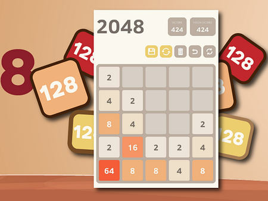

# 2048 Game



Welcome to the 2048 game! This is a simple and addictive puzzle game where the goal is to combine tiles with the same number to reach the number 2048.

## Features

- Classic 2048 gameplay
- Smooth animations
-  score tracking


## How to Play

1. Use the arrow keys  to move the tiles.
2. When two tiles with the same number touch, they merge into one.
3. The goal is to create a tile with the number 2048.

## Live Demo

Check out the live demo of the game [here](https://2048game-dun.vercel.app).

## Installation

To run the game locally, follow these steps:

1. Clone the repository:
   ```bash
   git clone https://github.com/yourusername/2048game.git
